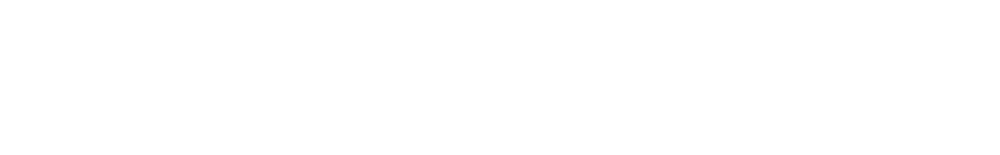
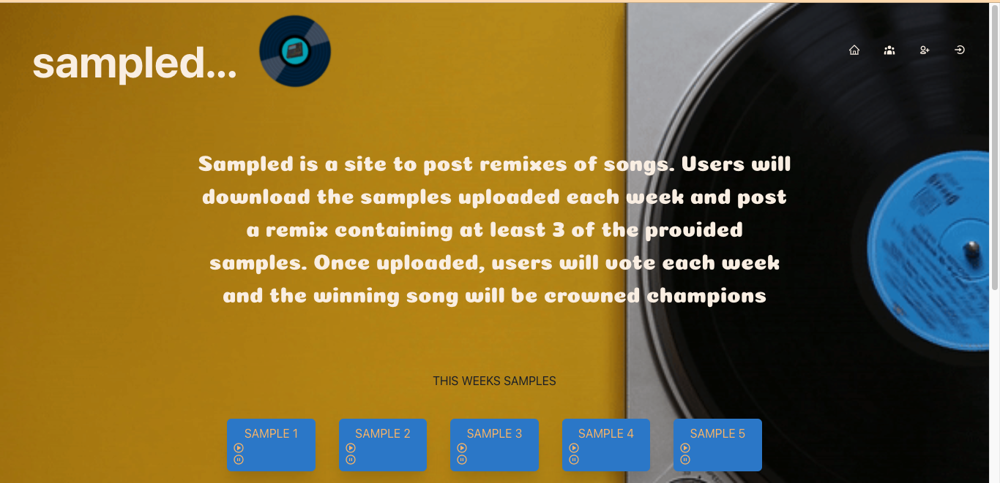

# Sampled...
### A beat battle comp

Github Repo
https://github.com/konnenhannaford/battle

Heroku Page
https://sampledbattle.herokuapp.com/

### Table of Contents  
  
   1. [Project Description](#1-description)
   2. [Technology Used](#2-technology)
   3. [Installation](#3-installation)
   4. [Usage](#4-usage)
   5. [License](#5-license)
   6. [Contribute](#6-how-to-contribute)
   7. [Tests](#7-tests)
   8. [Checklist](#8-checklist)

---
### 1. Description  

**What is this project?**  
* An application for users to upload and discover other users remixed music  

**Why this project?**  
* Music production has become alot more common in recent years with more DAW's becoming available and more users gaining access to these tools.  As one of these bedroom producers, I wanted to create an app that allowed for users to post remixes that they make and view those psoted by others.  With the implementation of voiting and compeititons, this type of service could grow for spreading music and growing artist relationships.  

#### Screengrab

 

**What problem does this project solve?**  
* Users who want the ability of sharing their remixes and competing against others

**Lessons learnt?**  
* GraphQL is powerful but requires alot of further practice 
* React has been used so familiarity with this has grown
* Apollo is something I need to practice A LOT as I had countless errors working with it
* Understanding Heroku and how to post

---
### 2. Technology

- APOLLO
- MONGOdb
- EXPRESS
- NODE
- NPM
- REACT
- GRAPHQL
- HOWLER
- CHAKRA
- REACT-ICONS

  
---
### 3. Installation 
You can download the source code from [my Github repository](https://github.com/konnenhannaford/battle) and unzip the files to a location on your computer. 

---

### 4. Usage  
- Running npm i after downloading will bring in any required dpendencies
- Npm start will start the sevrer an client side and will load the app on a local host
- Users can use the site as normal by accessign the Heroku link
- Users will sign up as a new artist filling in info about them
- This gets added to the artists page and can be updated in the update profile page
- Users can upload songs from update profile screena nd this gets added to the home page
- The user if logged in can dlete this song from the home page

---
### 5. License  
 The works in this repository are subject to:  

---
### 6. Contributers  
[Konnen Hannaford](https://github.com/konnenhannaford)

You can contribute by opening a pull request or submitting an issue.

 If you would like to contribute, please comply with the Contributor Covenant Code of Conduct:  

---
### 7. Tests  
- No unit tests have been prepared for this project.  Testing done on my desktop running different scenarios.  A problem exists causing the application to glitch when trying to change an employee after deleting their manager.  Needs to be resolved.

---
### 8. Checklist  
 All actions not checked are still to be completed:

 [x]  GitHub repository containing your application code.  
 [x]  Application connects to a MONGO database using GraphQL and Apollo  packages.
 [x]  The GitHub repository contains all the application code.  
 [x]  Repository has a unique name; follows best practice for file structure; and naming conventions.  
 [x]  Repository follows best practices for class/id naming conventions, indentation, quality comments, etc.  
 [x]  Repository contains multiple descriptive commit messages.  
 [x]  Repository contains a README file with description, screenshot and link to deployed application.  

